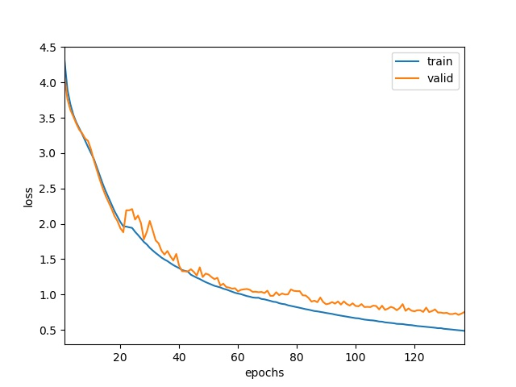

## End-to-End Speech Recognition on Pytorch

### Transformer-based Speech Recognition Model

 [](https://opensource.org/licenses/MIT) 

If you use any source codes included in this toolkit in your work, please cite the following paper.
- Winata, G. I., Madotto, A., Wu, C. S., & Fung, P. (2019). Code-Switched Language Models Using Neural Based Synthetic Data from Parallel Sentences. In Proceedings of the 23rd Conference on Computational Natural Language Learning (CoNLL) (pp. 271-280).
- Winata, G. I., Cahyawijaya, S., Lin, Z., Liu, Z., & Fung, P. (2019). Lightweight and Efficient End-to-End Speech Recognition Using Low-Rank Transformer. arXiv preprint arXiv:1910.13923. (Accepted by ICASSP 2020)
- Zhou, S., Dong, L., Xu, S., & Xu, B. (2018). Syllable-Based Sequence-to-Sequence Speech Recognition with the Transformer in Mandarin Chinese. Proc. Interspeech 2018, 791-795.

### Highlights
- supports batch parallelization on multi-GPU
- supports multiple dataset training and evaluation

### Requirements
- Python 3.5 or later
- Install Pytorch 1.4 (https://pytorch.org/)
- Install torchaudio (https://github.com/pytorch/audio)
- run ``❱❱❱ bash requirement.sh``

### Results
AiShell-1

| Decoding strategy | CER |
| ------------- | ------------- |
| Greedy | 14.5% |
| Beam-search (beam width=8) | 13.5% |

### Data
#### AiShell-1 (Chinese)
To preprocess the data. You need to download the data from https://www.openslr.org/33/. I will add a script to automate the process.
```console
❱❱❱ python data/aishell.py
```

#### Librispeech (English)
To automatically download the data
```console
❱❱❱ python data/librispeech.py
```

### Training
```console
usage: train.py [-h] [--train-manifest-list] [--valid-manifest-list] [--test-manifest-list] [--cuda] [--verbose] [--batch-size] [--labels-path] [--lr] [--name] [--save-folder] [--save-every] [--feat_extractor] [--emb_trg_sharing] [--shuffle] [--sample_rate] [--label-smoothing] [--window-size] [--window-stride] [--window] [--epochs]  [--src-max-len] [--tgt-max-len] [--warmup] [--momentum] [--lr-anneal] [--num-layers] [--num-heads] [--dim-model] [--dim-key] [--dim-value] [--dim-input] [--dim-inner] [--dim-emb] [--shuffle]
```
#### Parameters
```
- feat_extractor: "emb_cnn" or "vgg_cnn" as the feature extractor, or set "" for none
    - emb_cnn: add 4-layer 2D CNN
    - vgg_cnn: add 6-layer 2D CNN
- cuda: train on GPU
- shuffle: randomly shuffle every batch
```

#### Example
```console
❱❱❱ python train.py --train-manifest-list data/manifests/aishell_train_manifest.csv --valid-manifest-list data/manifests/aishell_dev_manifest.csv --test-manifest-list data/manifests/aishell_test_manifest.csv --cuda --batch-size 12 --labels-path data/labels/aishell_labels.json --lr 1e-4 --name aishell_drop0.1_cnn_batch12_4_vgg_layer4 --save-folder save/ --save-every 5 --feat_extractor vgg_cnn --dropout 0.1 --num-layers 4 --num-heads 8 --dim-model 512 --dim-key 64 --dim-value 64 --dim-input 161 --dim-inner 2048 --dim-emb 512 --shuffle --min-lr 1e-6 --k-lr 1
```
Use ``python train.py --help`` for more parameters and options.

#### Results
##### AiShell-1 Loss Curve


### Multi-GPU Training
```
usage: train.py [--parallel] [--device-ids]
```

#### Parameters
```
- parallel: split batches to GPUs (the number of batch has to be divisible by the number of GPUs)
- device-ids: GPU ids
```

#### Example
```console
❱❱❱ CUDA_VISIBLE_DEVICES=0,1 python train.py --train-manifest-list data/manifests/aishell_train_manifest.csv --valid-manifest-list data/manifests/aishell_dev_manifest.csv --test-manifest-list data/manifests/aishell_test_manifest.csv --cuda --batch-size 12 --labels-path data/labels/aishell_labels.json --lr 1e-4 --name aishell_drop0.1_cnn_batch12_4_vgg_layer4 --save-folder save/ --save-every 5 --feat_extractor vgg_cnn --dropout 0.1 --num-layers 4 --num-heads 8 --dim-model 512 --dim-key 64 --dim-value 64 --dim-input 161 --dim-inner 2048 --dim-emb 512 --shuffle --min-lr 1e-6 --k-lr 1 --parallel --device-ids 0 1
```
### Test
```
usage: test.py [-h] [--test-manifest] [--cuda] [--verbose] [--continue_from]
```
#### Parameters
```
- cuda: test on GPU
- continue_from: path to the trained model
```
#### Example
```console
❱❱❱ python test.py --test-manifest-list libri_test_clean_manifest.csv --cuda --continue_from save/model
```

Use ``python multi_train.py --help`` for more parameters and options.

### Custom Dataset
#### Manifest file
To use your own dataset, you must create a CSV manifest file using the following format:
```
/path/to/audio.wav,/path/to/text.txt
/path/to/audio2.wav,/path/to/text2.txt
...
```
Each line contains the path to the audio file and transcript file separated by a comma.

#### Label file
You need to specify all characters in the corpus by using the following JSON format:
```
[ 
  "_",
  "'",
  "A",
  ...,
  "Z",
  " "
]
```

## Bug Report
Feel free to create an issue
